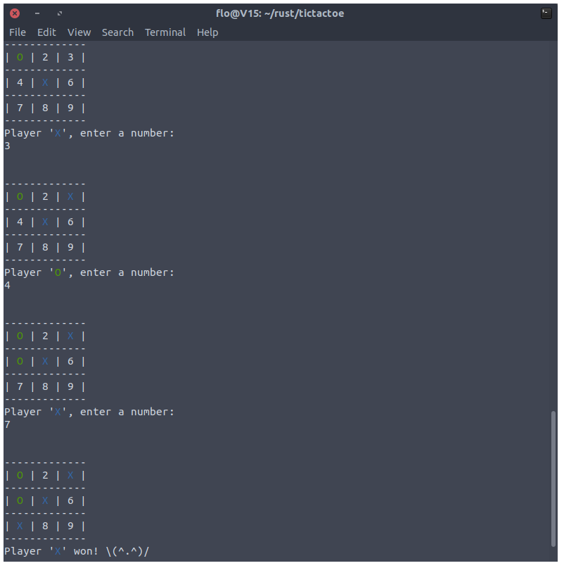

# rust tic-tac-toe

## DISCLAMER
I just started learning rust so the code should not be used as a example of 
good practice. This is is my first rust project, so if you have any suggestions
on how to improve the code feel free to write an issue. Maybe one day this code 
will become a showcase.

## Install
Go to the [latest release](https://github.com/flofriday/tictactoe/releases) and install the right binary for your system.

On Windows and macOS your computer might warn you because the binaries are not
singed. Feel free to ignore those warnings.

## Build
1. [Download](https://github.com/flofriday/tictactoe/archive/master.zip) the .zip or clone the project with git
2. [Install rust](https://www.rust-lang.org/en-US/install.html), if you have not already
3. Run `cargo run --release`
